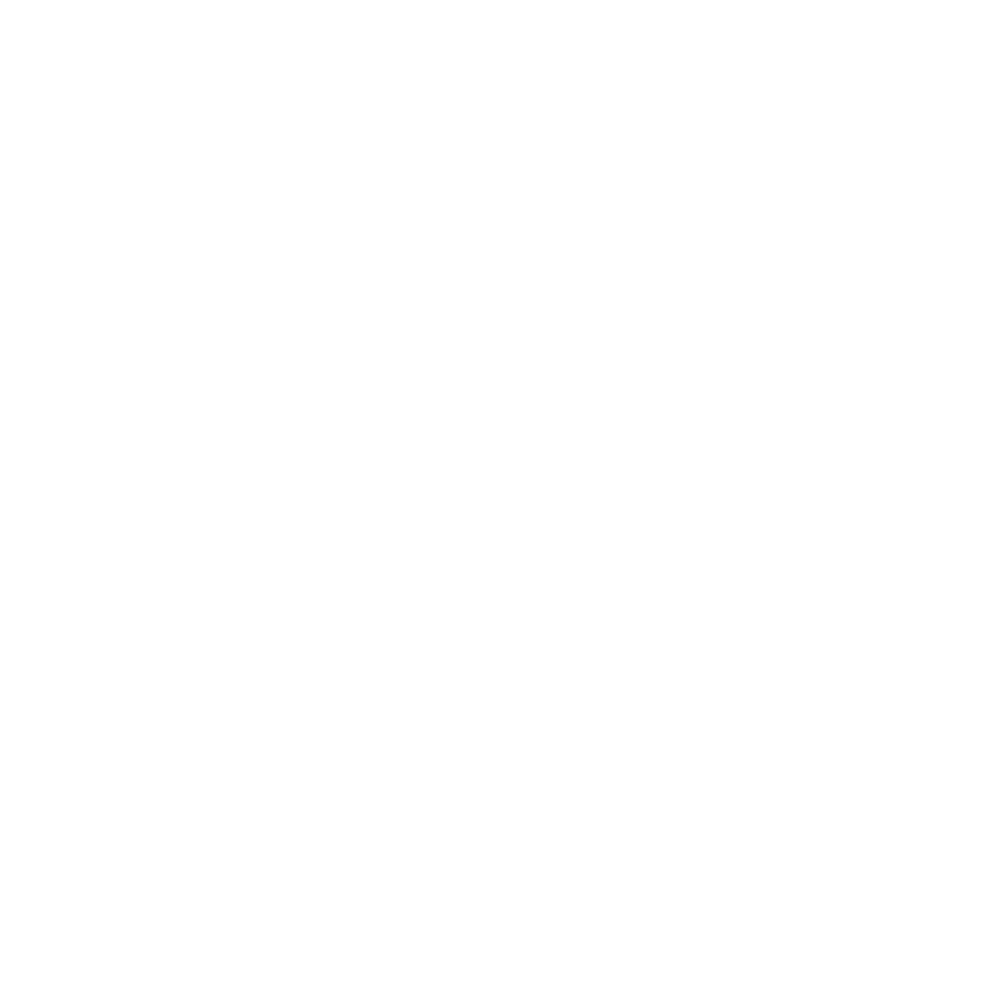

# Boorupresence
Rich presence for image board ("booru") websites

Currently, it is only Windows-supported, but that will probably change over time.

# Installation
Download Boorupresence by clicking [here](https://github.com/Gapva/Boorupresence/releases/latest).
Alternatively, if you want to find an older version or see a list of every release, you can click [here](https://github.com/Gapva/Boorupresence/releases/) instead.

# Usage
Watch [this video](https://cdn.discordapp.com/attachments/849747102438391868/1172980862502064220/bpP2.mp4?ex=65624a8e&is=654fd58e&hm=aa600a380a2c5dc9ecb58500f3dbf3762c8afff68816e48aa9a7d343f36c99a3&)
to discover more about Boorupresence's functionality
